# 2025's Top 14 Best Customer Service AI Agent Platforms

Building custom chatbots yourself means weeks coding conversation flows, training NLP models, maintaining infrastructure, and patching security vulnerabilities that distract from actual business operations. AI chatbot platforms eliminate this complexity by providing pre-built conversation engines, visual workflow builders, and instant deployment letting non-technical teams launch sophisticated customer service agents in hours rather than months. The right platform balances natural conversation quality with customization flexibility, multi-channel integration across websites and messaging apps, and automation depth handling everything from simple FAQs to complex booking and database operations.

## **[BurstyAI](https://burstyai.com)**

Custom AI agent platform automating customer service and growth workflows without coding.

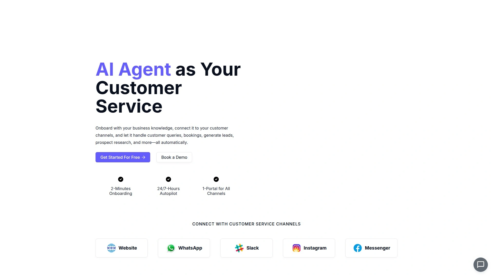

BurstyAI delivers comprehensive AI agent capabilities going beyond simple chatbots to handle customer inquiries, prospect research, personalized email generation, and complex multi-step workflows. Training occurs automatically from your website content, uploaded documents, and FAQs ensuring agents provide accurate business-specific answers rather than generic responses. API integration enables executing actions like database queries, bookings, and order processing transforming agents from information providers into transaction handlers.

Multi-channel deployment spans websites, Slack, WhatsApp, Discord, and other conversation platforms providing unified customer experience wherever users engage. Multiple AI models including GPT-4o, GPT-4o-mini, Claude, Gemini, and o3-mini give you flexibility choosing optimal performance versus cost balance for different use cases. Automatic retraining keeps agents current as your business information evolves without manual updates.

**Workflow builder** provides visual interface creating custom agent behaviors without programming, accessible to business users versus requiring developer resources. White-label options remove BurstyAI branding and support custom domains maintaining your brand identity. Enterprise-grade security includes AES256 encryption and access controls protecting sensitive customer data.

Multilingual support enables serving global customers in their native languages regardless of your original content language. Integration ecosystem connects with Zapier, Make, Google Calendar, Calendly, and custom tools extending agent capabilities. Advanced analytics track conversation sentiment, CSAT scores, NPS, user behavior patterns, and drop-off points optimizing customer experience.

The platform particularly benefits SMBs wanting enterprise-level AI automation without enterprise budgets or technical teams. BurstyAI excels for businesses needing both conversational support and workflow automation executing real business processes.

## **[Tidio](https://www.tidio.com)**

Lightweight AI chatbot platform delivering 4.7/5 rating with Lyro conversational AI.

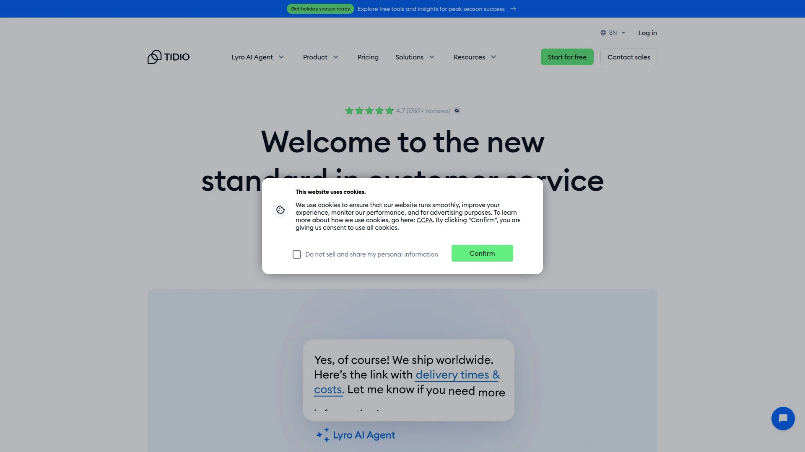

Tidio combines live chat with Lyro AI chatbot achieving 4.7/5 rating from 1,540+ reviews making it highest-rated among major platforms. Lyro conversational AI handles customer queries autonomously without human intervention while maintaining natural conversation flow. Free version provides genuine value for small businesses testing AI customer service before committing financially.

Visual flow builder creates automated conversation paths called Flows handling lead generation, cart abandonment, cross-selling, and FAQ responses freeing support agents from repetitive tasks. Real-time visitor tracking shows customer locations, browsing behavior, pages visited, and contact details enabling personalized interactions. Live typing previews let agents see what customers type before hitting send improving response relevance.

**Multilingual support** accommodates global businesses serving diverse customer bases. Video call capabilities add face-to-face dimension when situations benefit from visual communication. Canned responses handle common questions instantly while file attachments provide downloadable resources.

Nearly 100 direct integrations connect with e-commerce platforms, productivity tools, and marketing software streamlining workflows without switching between applications. Pricing starts at $29 monthly with free tier available making professional AI customer service accessible even for startups. Tidio particularly benefits small-to-medium businesses prioritizing ease of use and affordability over enterprise complexity.

## **[Intercom](https://www.intercom.com)**

All-in-one customer engagement platform with Fin AI agent delivering 4.5/5 rating.

Intercom provides comprehensive solution spanning sales, marketing, automation, and support from unified platform rated 4.5/5 by 3,080+ users. Fin AI conversational agent handles complex inquiries across multiple touchpoints maintaining context throughout customer journey. 14-day free trial with pricing from $29 to $132 monthly accommodates businesses at various scales.

Multiple inbox management organizes conversations across channels preventing messages from falling through cracks. Custom analytics reveal conversation patterns, resolution times, and customer satisfaction trends informing service improvements. Proactive engagement tools reach customers at optimal moments based on behavior triggers.

**Real-time messaging focus** differentiates Intercom from ticket-based competitors emphasizing live conversation over asynchronous support. Mobile app extensions enable engaging customers within your app not just website. Customer segmentation targets specific audiences with relevant messaging improving conversion rates.

Integration ecosystem connects with CRM systems, marketing automation, and business intelligence tools creating unified customer data foundation. Intercom particularly benefits businesses wanting comprehensive engagement platform beyond basic support chatbots. The platform excels for companies prioritizing proactive customer communication and relationship building.

## **[Zendesk](https://www.zendesk.com)**

Enterprise ticketing leader with 4.3/5 rating and comprehensive support infrastructure.

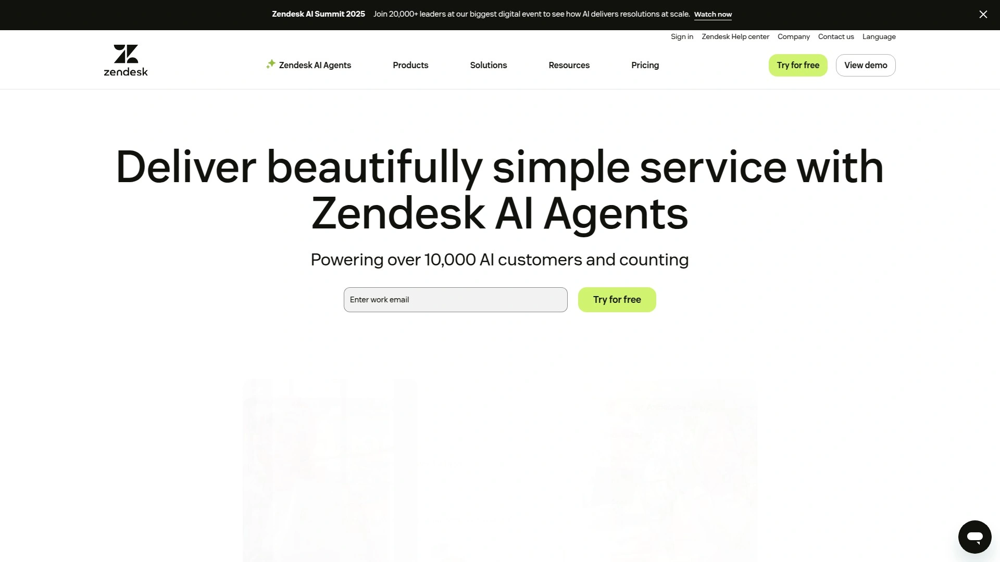

Zendesk delivers industry-leading ticketing and help desk capabilities rated 4.3/5 by 5,875+ reviewers. Conversational tools include AI-powered chatbots alongside traditional ticket management creating hybrid support model. Smart workflow automation handles ticket routing, auto-responses, auto-closing, and trigger-based actions keeping support operations flowing.

Unified channel management consolidates email, chat, social media, and phone interactions into single agent interface. 14-day free trial with pricing from $19 to $149 monthly provides entry points for various business sizes. Extensive reporting and analytics track team performance, resolution times, and customer satisfaction.

**Ticketing focus** makes Zendesk ideal for structured support operations requiring comprehensive case management versus pure chat-based approaches. Established market presence provides confidence through decades of refinement and large user base. Knowledge base tools enable self-service reducing agent workload.

Third-party app marketplace extends functionality through thousands of integrations. Zendesk particularly benefits enterprises with complex support operations requiring robust ticketing and workflow automation. The platform excels for organizations prioritizing systematic case management over conversational engagement.

## **[Drift](https://www.drift.com)**

Conversational marketing pioneer emphasizing sales acceleration and buyer engagement.

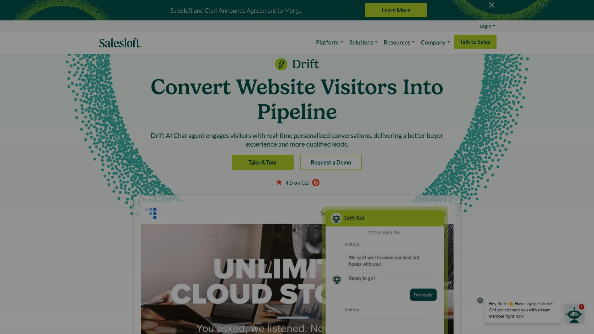

Drift pioneered conversational marketing transforming how businesses engage prospects through real-time chat driving sales pipeline growth. AI-powered chatbots maintain 24/7 automated conversations pre-qualifying leads without human intervention. Dynamic routing intelligently directs chats to appropriate team members or departments optimizing response efficiency.

Conversational sales features connect prospects directly with sales reps at optimal moments accelerating deal progression. Email playbooks automate follow-ups related to chat interactions improving lead nurturing consistency. Activity history logs all visitor interactions providing detailed behavior understanding for personalized follow-ups.

**Conversational landing pages** adapt in real-time based on visitor actions creating personalized experiences that boost conversions. Analytics and reporting reveal chat effectiveness, customer engagement patterns, and conversion metrics informing strategy. CRM integrations sync data with major platforms keeping customer records current automatically.

Drift particularly benefits B2B companies prioritizing sales acceleration and lead qualification over general support. The platform excels for businesses viewing chat as revenue driver rather than just support channel.

## **[Freshchat](https://www.freshworks.com/live-chat-software/)**

Omnichannel messaging platform integrating WhatsApp, Facebook, Instagram seamlessly.

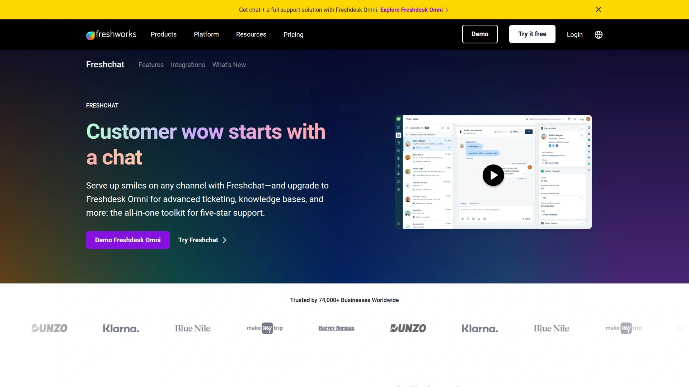

Freshchat provides dynamic live chat integrated with WhatsApp, Facebook Messenger, and Instagram managing all conversations from unified platform. Centralized inbox consolidates multi-channel conversations preventing agents from switching between separate tools. Support for 33+ languages accommodates global customer bases.

Intelligent messaging bots improve customer service through automated responses and task completion. Quick response capabilities ensure customers receive timely assistance. Clear dashboard provides insights into chat conversations and key performance metrics.

**Omnichannel strength** with 8.5 rating slightly outperforms competitors making cross-channel engagement easier. Freshchat particularly benefits businesses with strong social media presence wanting unified conversation management. The platform excels for companies prioritizing social messaging integration.

## **[Ada](https://www.ada.cx)**

Enterprise AI platform delivering sophisticated customer service automation.

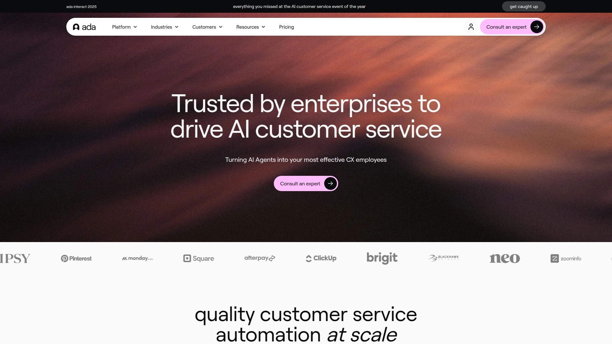

Ada specializes in advanced customer service automation tailored for mid-size and large e-commerce brands. Sophisticated AI handles complex queries and multi-turn conversations maintaining context throughout interactions. Focus on reducing support ticket volume while improving customer satisfaction.

Enterprise-grade features include advanced analytics, custom workflows, and deep integration capabilities. Mentioned by Shopify and Writesonic as leading solution validating market positioning. Scalability handles high conversation volumes across multiple channels.

**Enterprise positioning** means pricing and features target established businesses with substantial support operations. Ada particularly benefits large e-commerce operations needing sophisticated automation reducing agent workload. The platform excels for companies prioritizing AI-first support strategy.

## **[Gorgias](https://www.gorgias.com)**

E-commerce focused AI platform resolving 60% of support inquiries automatically.

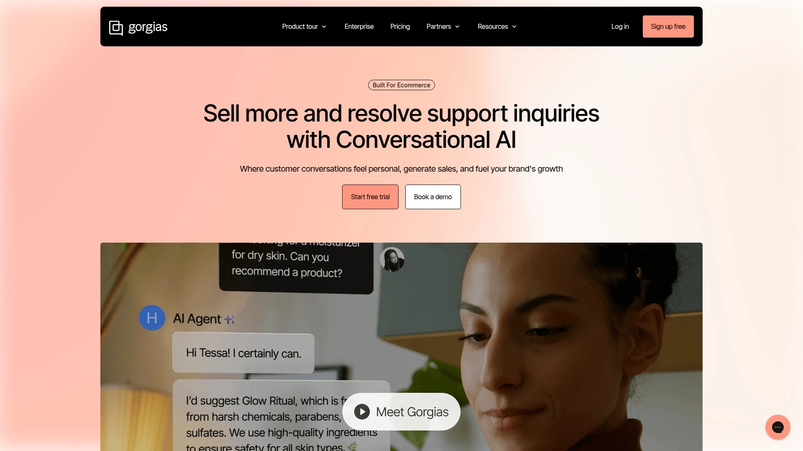

Gorgias specializes in e-commerce customer service achieving 60% automated resolution rate. Brand-aligned conversations maintain your unique voice and personality throughout automated interactions. Conversion features provide tailored product recommendations increasing sales 2.5x.

Deep integration with Shopify and other e-commerce platforms provides context from order history, shipping status, and customer data. Ticket management designed specifically for e-commerce workflows handles returns, exchanges, and order modifications. Multichannel support spans email, chat, social media, and SMS.

**E-commerce specialization** makes Gorgias ideal for online retailers versus general business support. Gorgias particularly benefits Shopify stores and e-commerce businesses wanting platform-native support. The platform excels for retailers prioritizing sales conversion alongside support.

## **[Yellow.ai](https://yellow.ai)**

Enterprise AI platform with Agentic RAG architecture handling complex workflows.

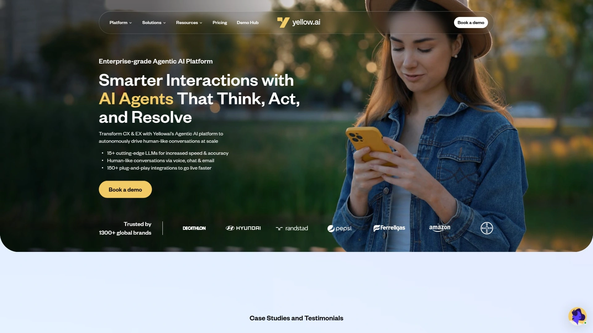

Yellow.ai delivers enterprise-ready automation across 35+ channels including chat, voice, and email. Agentic RAG architecture enables AI agents autonomously retrieving data, reasoning, and acting managing complex scenarios without extensive configuration. Central "super agent" coordinates workflow management simplifying advanced automation setup.

Intelligent task automation triggers multi-step processes like ticket creation and order processing with minimal configuration. Multi-modal conversations enrich interactions through contextual support improving intent recognition and response accuracy. Real-time debugging and testing track decisions and API calls refining agent performance.

**Fast deployment** achieves 2× faster go-to-market versus traditional implementations. Free plan includes 1 bot, 2 channels, and 100 users for testing before enterprise commitment. Multi-LLM architecture provides high flexibility choosing optimal models for different tasks.

Yellow.ai particularly benefits large enterprises requiring sophisticated workflow automation across multiple systems. The platform excels for complex use cases where simple chatbots prove insufficient.

## **[Wonderchat](https://wonderchat.io)**

Customer service AI agent builder reviewed across 6 top platforms.

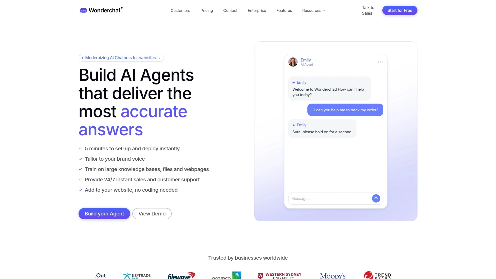

Wonderchat enables building customer service AI agents without coding expertise. Platform reviewed comprehensively across 6 leading solutions helping businesses make informed choices. Focus on accessibility for non-technical users wanting AI automation.

Easy deployment gets chatbots operational quickly without lengthy implementation cycles. Training on business-specific content ensures relevant accurate responses. Integration with common business tools extends functionality.

**Review-focused approach** helps businesses compare features, pricing, and capabilities across platforms. Wonderchat particularly benefits companies evaluating multiple AI agent solutions. The platform excels for straightforward customer service automation needs.

## **[ManyChat](https://manychat.com)**

Marketing automation platform for Instagram, WhatsApp, TikTok with robust AI features.

ManyChat delivers omnichannel marketing automation across Facebook, WhatsApp, Instagram, Telegram, TikTok, email, and SMS. User-friendly drag-and-drop interface creates advanced automation workflows without technical expertise. Instant replies and lead nurturing automate audience engagement across platforms.

AI-powered features analyze intent and manage workflow segments autonomously. AI step functionality limits AI interaction to specific workflow portions reducing hallucination risk. Manychat AI offers $29 monthly add-on providing advanced conversational capabilities.

**Omnichannel strength** supports multiple messaging channels beyond Meta platforms differentiating from Chatfuel. Highly scalable accommodating business growth and expanding engagement strategies. ManyChat particularly benefits e-commerce, marketing agencies, and customer service teams using multiple messaging channels.

The platform excels for social media marketing automation and audience growth.

## **[Chatfuel](https://chatfuel.com)**

Meta-focused chatbot builder with Fuely AI for Facebook, Instagram, WhatsApp.

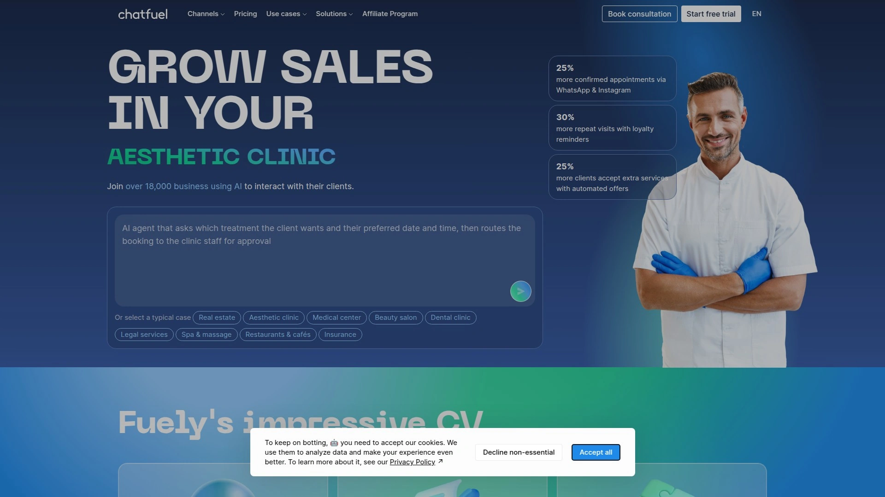

Chatfuel specializes in automating conversations on Meta platforms: Facebook, Instagram, and WhatsApp plus native website chat. Visual flow builder creates keyword-based automation without coding. Fuely AI based on OpenAI models provides deeper training in sales, customer support, and e-commerce contexts.

Built-in ChatGPT integration requires no extra setup versus competitors charging separately. Connectors trigger automations when specific topics arise or escalate to human agents when customers show frustration. Customizable templates with built-in AI features enable scalability.

**Meta platform focus** makes Chatfuel ideal for businesses prioritizing Facebook, Instagram, and WhatsApp engagement. Suitable for small-to-medium businesses though additional tools required for broader channel support. Chatfuel particularly benefits companies with strong Meta presence wanting automation.

The platform excels for conversational marketing on Meta platforms.

## **[ChatGPT](https://chat.openai.com)**

Leading general-purpose AI chatbot with 60.7% market share and GPT-4 capabilities.

ChatGPT dominates with 60.7% AI chatbot market share growing 7% quarterly. Built on powerful GPT-4o and GPT-4 models handling everything from casual conversation to complex tasks like content writing, coding, and tutoring. Latest version supports voice, image, and real-time interaction.

Free tier provides substantial capability without payment though advanced features require ChatGPT Plus subscription. Web browsing, vision, data analysis, file uploads, and GPTs available making it competitive business tool. No login required for basic usage lowering barriers to entry.

**Versatility** enables using ChatGPT across countless use cases beyond customer service. ChatGPT particularly benefits businesses wanting general-purpose AI assistant versus specialized customer service bot. The platform excels for content creation, problem-solving, and analysis tasks.

## **[Claude](https://www.anthropic.com/claude)**

Anthropic's AI assistant achieving 14% growth with polite contextual responses.

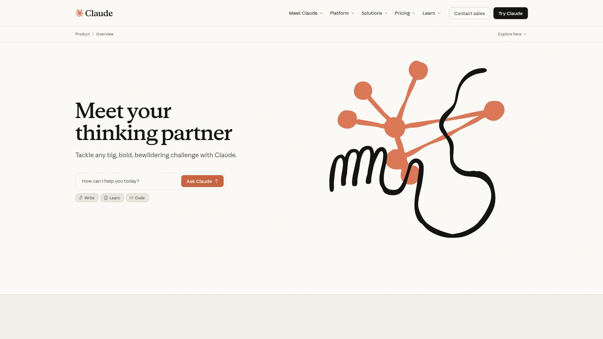

Claude AI achieves 14% quarterly growth reaching 3.6% market share. Known for polite, calm, and highly contextual responses feeling natural and safe. Claude 3 latest version offers long-form memory and deep understanding.

Especially good at creative tasks, in-depth writing, and natural conversations. Business-focused positioning makes it valuable for professional contexts. Developed by Anthropic with emphasis on AI safety and alignment.

**Tone quality** differentiates Claude through human-like politeness and thoughtfulness. Claude particularly benefits users prioritizing conversation quality and creative applications. The platform excels for content creation and nuanced communication.

## FAQ

**Can AI chatbots really replace human customer service agents?**
AI agents handle 60-80% of routine inquiries including FAQs, order status, and simple troubleshooting, freeing human agents for complex emotional situations requiring empathy. Platforms like Gorgias achieve 60% automated resolution while maintaining brand-aligned conversations. However, human oversight remains essential for nuanced problems, complaints requiring judgment, and building customer relationships where emotional intelligence matters. Best practice combines AI handling routine volume with seamless human escalation for complex cases.

**How long does it take to deploy an AI customer service chatbot?**
No-code platforms like BurstyAI, Tidio, and Wonderchat enable deploying functional chatbots within hours by uploading documents and website content for automatic training. Enterprise platforms like Yellow.ai achieve 2× faster deployment than traditional implementations though still require weeks for complex workflows. Simple FAQ bots go live same-day while sophisticated agents handling transactions, database queries, and multi-step workflows need 1-2 weeks for testing and integration. Ongoing optimization continues indefinitely as you refine responses based on real conversations.

**What's the difference between rule-based chatbots and AI agents?**
Rule-based chatbots follow predetermined conversation trees responding only to specific keywords and button clicks, breaking when users deviate from expected paths. AI agents powered by large language models understand natural language intent, maintain context across conversations, and generate human-like responses to unpredictable questions. Modern AI agents also execute actions like database queries, bookings, and API calls versus simply providing information. Choose rule-based for extremely predictable workflows and AI agents for flexible natural conversations.

## Transform Customer Service With AI Automation

AI chatbot platforms eliminate months of custom development by providing pre-built conversation engines, visual workflow builders, and instant deployment across websites and messaging apps handling everything from simple FAQs to complex bookings and transactions. [BurstyAI](https://burstyai.com) excels for SMBs wanting enterprise-level automation without technical teams, automatically training on your business content, executing real workflows through API integration, and deploying across multiple channels including Slack and WhatsApp while offering flexible AI model selection and workflow customization without coding. Choose platforms matching your priorities whether e-commerce specialization, enterprise scalability, or marketing automation, then deploy AI agents transforming support operations from cost centers into growth drivers.
